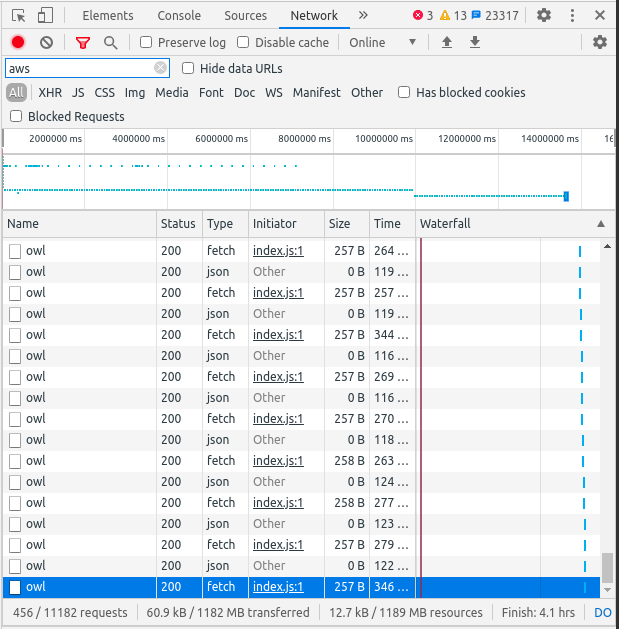
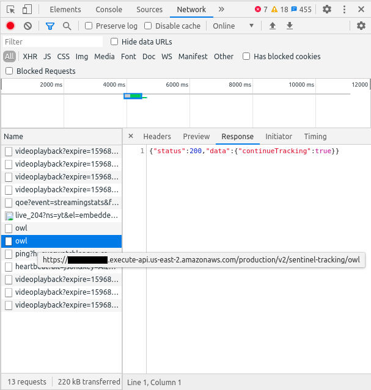

Written on 08.08.2020

# Content
### [General Information](#general-information-1)
### [The URL breakdown](#the-url-breakdown-1)
### [How to open the Developer Tools?](#how-to-open-the-developer-tools-1)
### [What am I supposed to do?](#what-am-i-supposed-to-do-1)

# General Information

This guide was written with Chrome, but should cover the new chromium based Microsoft Edge. It *should* be easy to transfer this information to Mozilla Firefox. Any other browser might be usable, but no guarantees.

This might be a little bit technical, but I hope, it is usable even for people, which never done this before or don't even care.

And the english might be broken, but hopefully understandable. I'll do my best to fix it.

---

This image shows the Chrome Developer Tools on a stream, while gaining tokens on a match site (also referred to "Live Now" Page).

Note the following things:
- An filter is applied to only show requests containing "aws". Without it, this would be much more crowded and active (if you try it yourself).
- The filter does not affect the graph above, only the table.
- The blue rectangle in the graph in the upper half of the image shows the marked entry in the table below. The (almost) solid line on the height of the rectangle are these "owl" requests.
- The two almost solid lines (see the split at 10000000ms) are both the "owl" requests. Effectively it is one line from beginning to end. (The split is not guaranteed to happen, nor is it necessary.)
- We have the "Type: `json`" and "Type: `fetch`" requests, always coming in pairs (without a filter, depending on timing, something else might be between them, but they are generally always together).
- The full URL is `https://*.execute-api.us-east-2.amazonaws.com/production/v2/sentinel-tracking/owl` (more on that below)
- Depending on your configuration, other columns might be visible. For example Mozilla Firefox showed for me without any configuration the column "Domain", which would contain `*.execute-api.us-east-2.amazonaws.com`.
- The `*` is a placeholder. You will not see a `*` in the URL.
- Right Click on a column header (like Name) to choose, which columns should be visible.
- At least for Chrome, as long as this window is not open, it will not record. Meaning: if you open it 2 hours in, it is expected to be empty.

---

Again Chrome Developer Tools on a stream, gaining tokens. This time on the homepage.

Note:
- No filter is applied, other requests are shown.
- This was at the start of the stream.
- The response shown is for the "Type: fetch". You have to click on the table entry ("owl"), and maybe switch to the "Response" Tab yourself. The X to the left of "Headers" only closes this small section. Note: Updates on the server might change the `Response` data in the future.
- The mouse is hovering over the "owl", which caused the full URL to appear.
- The blackout might be not needed, but without being 100% certain I did it anyways. The black bar is represented in this text be the `*`.

# The URL breakdown
### `https://*.execute-api.us-east-2.amazonaws.com/production/v2/sentinel-tracking/owl`
### Or: How does the request I look for looks like?

- Protocol (here `https:`)
    - Should always stay the same

- Domain (here `*.execute-api.us-east-2.amazonaws.com`)
    - `*`
    - - Might be a random string, might be something user related, might be server related, might always be the same.
    - - Be aware: the `*` is a stand in for anything (for example `abcdefg`). At the time of writing, I do not know, what purpose this part serves and how/if it may differ.
    - `execute-api`
    - - probably always part of the domain
    - `us-east-2`
    - - Might change? But probably sticks at least to a US server. (NA or APAC game does not matter)
    - `amazonaws.com`
    - - As long as OWL does not switch to a different host for the api, this part should **ALWAYS** be the same.

- Path (here `/production/v2/sentinel-tracking/owl`)
    - Even after (minor) updates, this is expected to stay the same. Might change on bigger updates or for other/unrelated reasons.

# How to open the Developer Tools?
I use F12 on Chrome and Firefox, but I do not see this in the documentation.
- [Chrome](https://developers.google.com/web/tools/chrome-devtools/open) or go to the menu (3 Dots in the top right) -> "More Tools" -> "Developer Tools"
- On Firefox open the menu (the 3 bars in the top right) -> "Web-Developer" -> "Show/Hide Tools"
- For both browsers you might need to change to the "Network" (or similar) Tab manually.

# What am I supposed to do?
### With the knowledge above, you should be able to detect, if you have any chance of getting tokens (assuming, your account was made in a eligible country and the functionality of the page did not change).
Note: Console players might be required to do extra steps. Please consult [the US Blizzard forums](https://us.forums.blizzard.com/en/overwatch/t/2020-overwatch-league-streaming-rewards-guide-double-token-weekend/455165) or your favorite search engine.

1. Open your browser.
2. Navigate to https://www.overwatchleague.com
3. If not already done: Log-In
    - If you are asked to grant permissions, grant all 3 of them. It might be possible, to make it work with the bare minimum (the mobile app has only the bare minimum), but I have not tested it.
4. Press F12 (or see [How to open the Developer Tools?](#how-to-open-the-developer-tools-1)) and in the newly opened section, select "Network" (depending on browser, naming might be similar, not equal)
5. (Optional) Into the filter type `aws`
6. Assuming OWL is live: Wait. (Bare minimum is 1 minute, I recommended 2-5 minutes)
7. Did something matching the above description appear?
    - No: Reload the page and go back to step 6.
    - Yes: Congratulations! You *should* be earning tokens.
    At this point, you can close the F12 window (by pressing the X on screen or pressing F12 on your keyboard).
        - I do not know, if this is a recent change, but even if your internet cuts out, it will still try to "ping" the server. The moment your internet comes back, it should (1 minute from the last try) continue to work and give you tokens, without you doing anything. The time you lost by no internet is (probably) lost for good.

If you **reload** the page, navigate to a different page (for example to the owl schedule) or close and open the browser you will need go through these steps again.

If you have the console open, warnings and errors are to be expected.

If these requests do not show up or you did not gain any tokens, please visit [the US Blizzard forums](https://us.forums.blizzard.com/en/overwatch/t/2020-overwatch-league-streaming-rewards-guide-double-token-weekend/455165).
